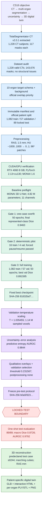

# Project flowchart — editable Mermaid source

```mermaid
flowchart TB
    A["CS16 objective<br/>CT → multi-organ segmentation → uncertainty → 3D digital twin"]
    B["TotalSegmentator CT v2.0.1 extracted<br/>1,228 CT subjects; 117 masks each"]
    C["Dataset audit<br/>1,228 valid CTs; 143,676 masks; no structural issues"]
    D["10-organ target schema + background<br/>official overlap priority"]
    E["Immutable manifest and official patient split<br/>1,082 train / 57 validation / 89 locked test"]
    F["Preprocessing<br/>RAS; 1.5 mm; HU −1000..1000 → 0..1; 96³ patches"]
    G["CUDA/GPU verification<br/>RTX 4060 8 GB; PyTorch 2.13+cu130; MONAI 1.6"]
    H["Baseline preflight<br/>MONAI 3D U-Net; 4.82 M parameters; 11 channels"]
    I["Gate 1: one-case overfit<br/>50 epochs; final represented-class Dice 0.9463"]
    J["Gate 2: deterministic pilot<br/>16 train / 4 val; forced pause/resume passed"]
    K["Gate 3: full training<br/>1,082 train / 57 val; 50 epochs; best val Dice 0.891595"]
    L["Fixed best checkpoint<br/>SHA-256 81632bd7…"]
    M["Validation temperature scaling<br/>T = 1.035455; 1.14 M sampled voxels"]
    N["Uncertainty–error analysis<br/>predictive entropy AUROC 0.9844"]
    O["Qualitative overlays + validation selection<br/>threshold 0.231567; postprocessing none"]
    P["Freeze pre-test protocol<br/>SHA-256 b0a5f323…"]
    Q{{"LOCKED-TEST BOUNDARY"}}
    R["One-shot test evaluation<br/>89/89; macro Dice 0.8726; AUROC 0.9792"]
    S["3D reconstruction<br/>predeclared test case s0244; marching cubes; RAS mm"]
    T["Patient-specific digital twin<br/>GLB + interactive HTML + per-organ PLY/STL + PNG"]

    A --> B --> C --> D --> E --> F --> G --> H --> I --> J --> K --> L --> M --> N --> O --> P --> Q --> R --> S --> T

    classDef data fill:#dceeff,stroke:#2c6da4,color:#132238;
    classDef train fill:#def4e9,stroke:#267758,color:#132238;
    classDef decision fill:#eadcff,stroke:#744ba1,color:#132238;
    classDef lock fill:#ffe1e1,stroke:#b43636,color:#8f2020;
    classDef output fill:#dff5df,stroke:#347b38,color:#132238;
    class B,C,D,E,F data;
    class G,H,I,J,K,L train;
    class M,N,O,P decision;
    class Q,R lock;
    class S,T output;
```

Rendered files:

- `PROJECT_FLOWCHART.png`
- `PROJECT_FLOWCHART.svg`
